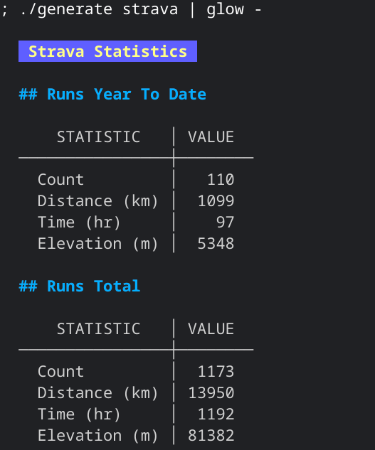

# Experimental and early monitoring

The idea is to eventually have multiple instances of the setup in this directory, for different services, with the API keys properly managed. Here's the first incarnation with the first service, Strava.

This is what I do with these files.

## Set up the API credentials

Maintain the values in `strava-base.json`, based on my OAuth registration at Strava
* `client_id`
* `client_secret`
* (the API base is public and already in there)

Maintain a single initial value in `strava-token.json` which can then be used to ask for a new access_token:
* `refresh_token`

## Make an API call

For example:

```shell
./callapi strava /athletes/16094179/stats > strava-data.json
```

Note the naming convention here too: `<service>-data.json`.

## Generate output in Markdown

Using a simple template:

```shell
./generate strava
```

This takes the Markdown content in `strava-template`, which includes embedded `jq` expressions that take data from `strava-data.json`, and produces Markdown with the values from evaluating those expressions.

This can be displayed nicely in the terminal with [glow](https://github.com/charmbracelet/glow), for example, which is then suitable for a monitor display where (`tmux`) windows of data are presented in a cyclic display.

The invocation `./generate strava | glow -` produced something like this:



